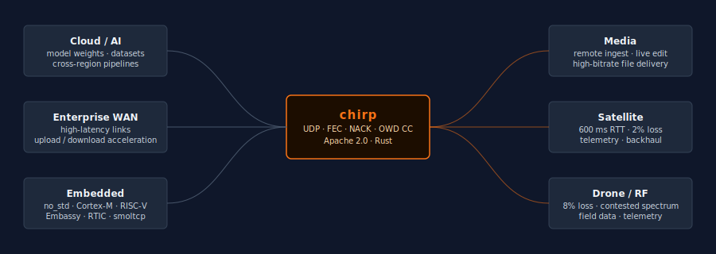

<p align="center">
  <picture>
    <source media="(prefers-color-scheme: dark)"  srcset="assets/chirp-logo-dark.svg">
    <source media="(prefers-color-scheme: light)" srcset="assets/chirp-logo-light.svg">
    
  </picture>
</p>

<p align="center">
  <a href="https://github.com/userFRM/chirp/actions/workflows/ci.yml"></a>
  <a href="https://crates.io/crates/chirp"></a>
  <a href="LICENSE"></a>
</p>

<p align="center"><b>File transfer that holds speed when networks don't cooperate.</b></p>

---

TCP collapses under loss. At 1% loss / 100 ms RTT, the Mathis formula caps TCP at ~7 Mbps on a gigabit link. chirp uses UDP with NACK retransmission, XOR forward error correction, and a delay-based congestion controller that treats random loss as noise — not congestion. The result: sustained throughput on the links where conventional stacks fall apart.

## Benchmarks

20 MB transfers, `tc netem` impairment, Linux x86-64. TCP column estimated via `T ≈ MSS/(RTT·√p)`.

| Scenario | Loss | RTT | chirp | TCP (est.) |
|---|---|---|---|---|
| Clean | 0% | 0 ms | **172.9 Mbps** | saturates NIC |
| LAN + jitter | 0.1% | 4 ms | **98.6 Mbps** | ~4 Gbps |
| Enterprise WAN | 0.5% | 160 ms | **30.9 Mbps** | ~3–5 Mbps |
| Lossy WAN | 2% | 240 ms | **22.2 Mbps** | ~1–2 Mbps |
| Satellite | 2% | 600 ms | **12.9 Mbps** | ~0.5 Mbps |
| Drone link | 8% | 200 ms | **15.0 Mbps** | ~0.3 Mbps |

---

## Where it fits

<p align="center">
  
</p>

---

## Getting started

```toml
[dependencies]
chirp = "0.1"

# no_std + alloc only (embedded / protocol primitives)
chirp = { version = "0.1", default-features = false, features = ["alloc"] }
```

### Send a file

```rust
use chirp::sender::{ChirpSender, SenderConfig};

let config = SenderConfig {
    remote_addr: "10.0.0.1:9000".parse()?,
    initial_rate_bps: 20_000_000,
    ..Default::default()
};
let stats = ChirpSender::new(config).await?.send_file(Path::new("payload.bin")).await?;
println!("{:.1} Mbps — {} retransmits", stats.throughput_mbps(), stats.retransmissions);
```

### Receive a file

```rust
use chirp::receiver::{ChirpReceiver, ReceiverConfig};

let receiver = ChirpReceiver::new(ReceiverConfig {
    bind_addr: "0.0.0.0:9000".parse()?,
    ..Default::default()
}).await?;
receiver.receive_file(Path::new("output.bin")).await?;
```

### CLI

```bash
chirp-recv 9000 --output /tmp/out.bin
chirp-send payload.bin 10.0.0.1:9000 --rate 20
```

---

## Architecture

| | `no_std + alloc` | `std + tokio` |
|---|---|---|
| **modules** | `packet` · `fec` · `nack` · `congestion` | `sender` · `receiver` |
| **CLI** | — | `chirp-send` · `chirp-recv` |
| **deps** | `hashbrown` · `fugit` · `libm` · `bitflags` | `tokio` · `aes-gcm` · `tracing` · `clap` |
| **targets** | Cortex-M · RISC-V · Embassy · RTIC · bare-metal | Linux · macOS · Windows |

The protocol core compiles with `no_std + alloc` — zero OS dependencies. For embedded targets, wire your own UDP send/recv against the hardware driver and call the packet/FEC/NACK/congestion primitives directly.

---

## Protocol

- **FEC** — XOR parity every 8 data packets. Single loss per block recovered without a round-trip.
- **NACK** — selective retransmit, sliding gap window (16,384 packets ≈ 19 MB). Full-scan post-FIN.
- **Congestion control** — one-way delay gradient over a sliding window. Rising delay → rate cut. Loss is a no-op. RF loss is not congestion.
- **SYN** — 10-attempt retry with backoff; `ConnectionRefused` is retryable.
- **FIN drain** — sender retransmits all NACKd packets until FIN-ACK received.

---

## vs. the alternatives

Byteport DART and IBM Aspera FASP solve the same problem — both claim 10× TCP on impaired links. Both are proprietary, priced per seat or per GB, and closed to modification. chirp is the open-source alternative: same protocol class, Apache 2.0, embeddable down to bare metal.

| | chirp | [Byteport DART](https://byteport.com) | [Aspera FASP](https://www.ibm.com/products/aspera) | QUIC |
|---|---|---|---|---|
| License | **Apache 2.0** | Proprietary | Proprietary | Various |
| Language | **Rust** | C/C++ | C | Various |
| Cost | **Free** | Paid SaaS | Paid license | Free |
| `no_std` protocol core | **✅** | ❌ | ❌ | ❌ |
| Self-hostable | **✅** | Limited | Limited | ✅ |
| Embedded targets | **✅** | ❌ | ❌ | ❌ |
| FEC | ✅ | ✅ | ✅ | ❌ |
| Delay-based CC | ✅ | ✅ | ✅ | Partial |
| Source available | **✅** | ❌ | ❌ | ✅ |

---

## Tests

```bash
cargo test --lib                  # 21 unit tests, no network required
cargo test --test loopback        # integration loopback
sudo bash scripts/netem_suite.sh  # 7-scenario netem suite (Linux, requires root)
```

## Contributing

See [CONTRIBUTING.md](CONTRIBUTING.md).

## Acknowledgements

- [`fugit`](https://crates.io/crates/fugit) — type-safe, no_std time abstractions
- [`hashbrown`](https://crates.io/crates/hashbrown) — SwissTable hash maps with no_std support
- [`libm`](https://crates.io/crates/libm) — IEEE 754 float math for bare-metal
- [`tokio`](https://tokio.rs) — async runtime
- [`aes-gcm`](https://crates.io/crates/aes-gcm) — authenticated encryption
- [`bytes`](https://crates.io/crates/bytes) — zero-copy byte buffers

## License

Apache 2.0 — see [LICENSE](LICENSE).
